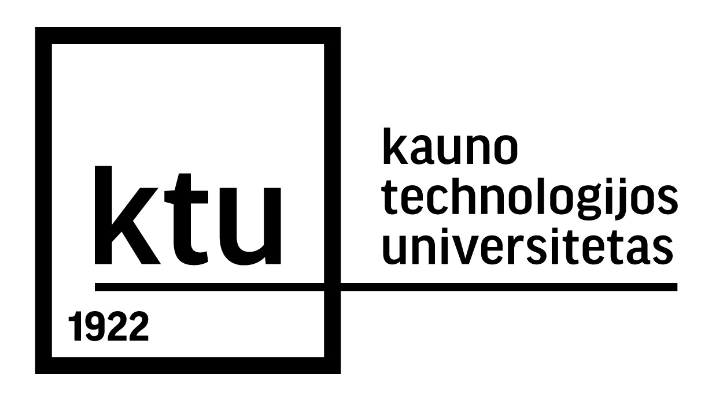
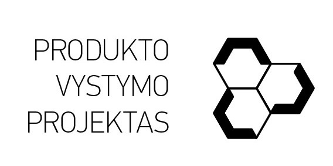

# PVP | K389 Įveik kalbėjimo baimę

## Aprašymas

<table><tr>
    <td></td>
    <td></td>
</tr></table>

- **PR00B251 Produkto vystymo projektas** | ***Įveik kalbėjimo baimę***\
Tai VR-3D projektas, kuriame siekiama skatinti jauno amžiaus individus šnekėtis su žaidime esančiais personažais. Šių personažų elgseną realizuoja sudėtingi dirbtinio intelekto kalbos modeliai bei garso modeliai.

## Turinys

- [Komandos sudėtis](#komandos-sudėtis)
- [Naudojama programinė įranga ir įrankiai](#naudojama-programinė-įranga-ir-įrankiai)
- [Projekto diegimas](#projekto-diegimas)
- [Šaltiniai](#šaltiniai)


## Komandos sudėtis

**K389 Komanda:**

- [Gvidas Ambrozaitis IFF-1/3](https://github.com/kahunas)
- [Simonas Skučas IFB-1](https://github.com/Sanomis02)
- [Domas Rinkevičius IFC-1](https://github.com/domrin)
- [Ignas Vytėnas IFZm-1](https://github.com/Ignqs)
- Andrėja Minkevičiūtė IFF-1/9

**Mentorius: [prof. dr. Tomas Blažauskas](https://ktu.edu/scientist/tomas.blazauskas/)**

## Naudojama programinė įranga ir įrankiai

- [Unity 2022.3.20f1 LTS](https://unity.com/)
- [ProBuilder Unity įskiepis](https://unity.com/features/probuilder)
- VR akiniai (pavadinimas)
- [OpenAI ChatGPT API](https://openai.com/blog/introducing-chatgpt-and-whisper-apis)
- [OpenAI ChatGPT Unity paketas](https://github.com/srcnalt/OpenAI-Unity)

## Projekto diegimas

```shell
git clone https://github.com/Sanomis02/Iveik-kalbejimo-baime-PVP
```

## Šaltiniai

- [Žaidėjo judėjimui naudotas pavyzdys](https://www.youtube.com/watch?v=f473C43s8nE)
- https://www.overleaf.com/project/65ccee4acee3686482ad5173
